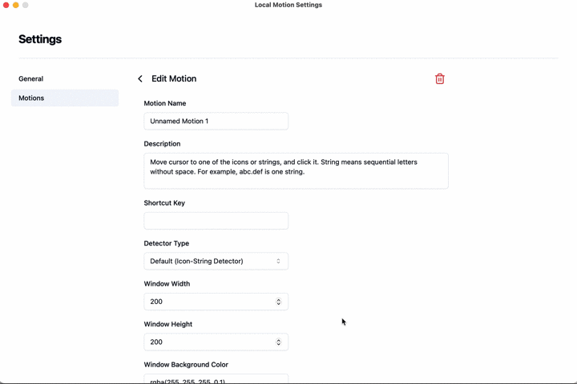
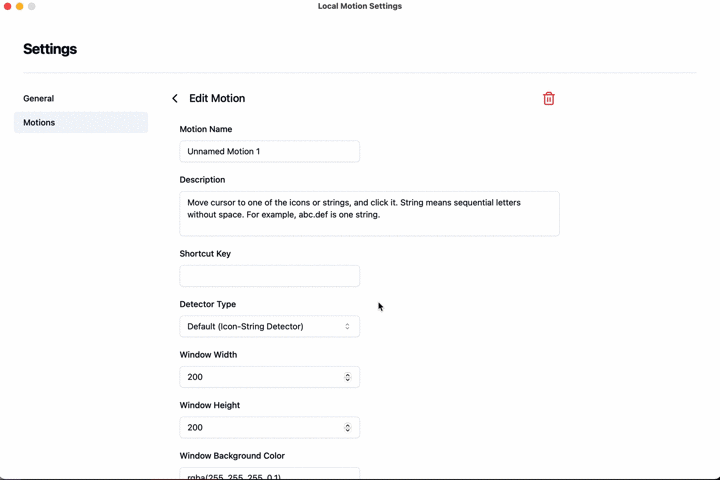
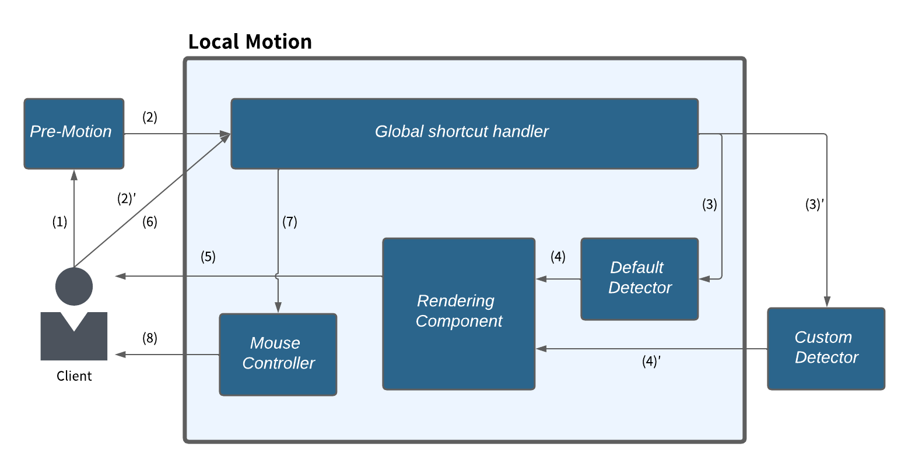

# Local Motion

Local Motion detects objects, such as icons, text, or any elements near the current mouse position, moves the mouse cursor to these objects using keyboard navigation, and executes actions such as clicking.

It is designed to be activated after the mouse cursor has been roughly moved by another mouse control application, subsequently providing suggestions for precise movement adjustments.

**Local Motion with Default Detector + [Talon](https://talonvoice.com/) + [Tobii Eye Tracker 5](https://gaming.tobii.com/product/eye-tracker-5/)**

**Local Motion with Custom Detector ([Word Detector](https://github.com/oyam/local-motion-examples/tree/main/custom-detectors/word-detector/python)) + [Talon](https://talonvoice.com/) + [Tobii Eye Tracker 5](https://gaming.tobii.com/product/eye-tracker-5/)**

### Platforms-supported:

- Windows
- macOS

### Architecture and flow

- For details about the flow and features of Local Motion, please see [docs/flow.md](docs/flow.md).
- For examples of pre-motions and custom detector, please check out [local-motion-examples](https://github.com/oyam/local-motion-examples).

### Installation
- Bundles for each OS are not currently available. Please build it yourself. See [app/README.md](app/README.md).
- Please read [Settings](#settings), [Security](#security) and [Note](#note) sections before using Local Motion.

### Settings
- Download [yolov8n.onnx](https://drive.google.com/drive/folders/1o5UHZue8TT5CCApTfM1TF0s9-b-Vsnx4?usp=drive_link) (latest model is recommended) and place it in app/src-tauri/models folder before building the app.
- settings of Local Motion can be opened from system tray.
- When the app launches, a folder named .local-motion is created in the home directory, and within it, settings.json and local-motion.log are generated.

### Security
- Local Motion requires permissions to take screenshots, use global shortcuts, and control the mouse cursor, meaning you may need to grant permissions in your OS settings. For instance, the following steps are necessary to use Local Motion on macOS:
    - Go to Apple menu > System Settings > Privacy & Security > Screen & System Audio Recording. Turn the switch for Local Motion on.
    - Go to Apple menu > System Settings > Privacy & Security > Accessibility. Turn the switch for Local Motion on.
- Please be aware that parts of screenshots will be sent when using custom detectors. It's recommended to confirm the custom detector is reliable.

### Note
This project is currently in an experimental and development phase. Please be aware of the following points:
- Only the main screen is supported.
- The development of a more robust and accurate default detector is ongoing. Models may be replaced without prior notice.
- Shortcuts for each motion cannot currently be set using actual keystrokes. Instead, shortcuts must be configured using text-based accelerators, such as Shift+Alt+T. For information on accelerators that can be used with this configuration, refer to the following resources:
    - Modifier: https://github.com/tauri-apps/tao/blob/f9f81f2fd761c60abb5b46a6469864562a811c6d/src/accelerator.rs#L333
    - Other keys: https://github.com/tauri-apps/tao/blob/c7fac6b2d365aa47d62fc908617367dd5971799d/src/keyboard.rs#L674

### Licenses and Attributions

This project uses third-party components under various open source licenses. For detailed information on the licenses, attributions, and notices for these components, please see [Attribution Documentation](./docs/ATTRIBUTION.md).

Additionally, the project itself is licensed under the MIT License. For more details, see the [LICENSE](./LICENSE) file.
